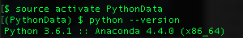
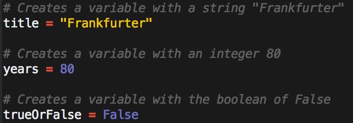
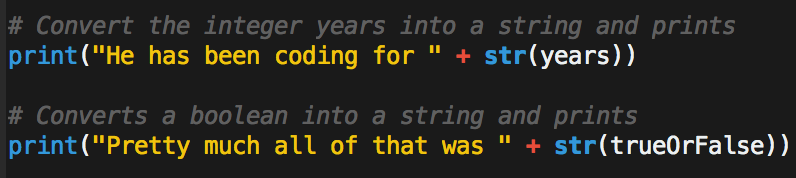
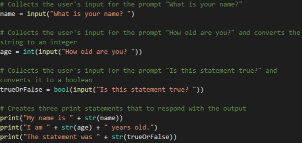
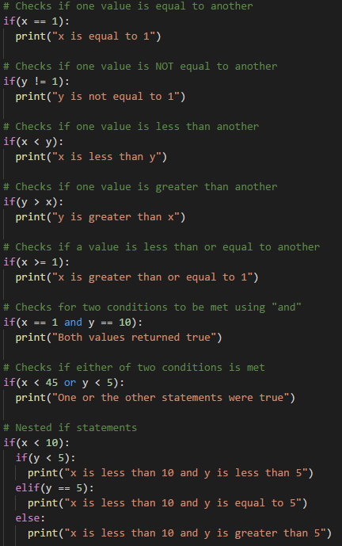
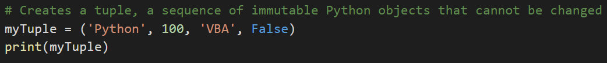

#  3.1 Lecture Notes: Let's Begin Python!

### Overview

In today's class, we will transition from VBA to the programming language Python.

### Objectives

* Have Python 3 Installed on your computer.
* Be able to navigate your computer via the terminal.
* Be able to create Python scripts and run them in the terminal.
* Begin to understand programming concepts in Python.

### Anaconda installation

* To check install, enter `conda --version` which will display the version of Anaconda install.

* The most common issue is with Windows that don't have the Anaconda PATH variable set.

* This can be fixed by manually adding the PATH to Windows' environment variables, but can be more easily solved by uninstalling/reinstalling Anaconda and making sure to check the "Install to Path" box that comes up in a menu.

### Creating A Virtual Environment

* [Virtual Environments](https://conda.io/docs/user-guide/tasks/manage-environments.html).

* Virtual environments create an isolated environment for Python projects that may have different dependencies or use different types and versions of libraries (e.g., Python2 or Python3).

* To create a virtual environment that will run Python 3.6 run `conda create -n PythonData python=3.6 anaconda` in terminal. This may take a few minutes to install.

* To activate the environment enter `source activate PythonData` . When `(PythonData)$` appears at the command prompt, this means you are in the environment.

* Make sure you are using the correct version of Python by entering `python --version`

* Exit the environment by entering `source deactivate`

* See information about your environment using the commands `conda info --env` or `conda env list`

* To remove an environment: `conda remove --name myenv --all`
[conda documentation](https://conda.io/docs/user-guide/tasks/manage-environments.html)

### Terminal

* Common Terminal Commands

* `cd` (Changes the directory)

* `cd ~` (Changes to the home directory)

* `cd ..` (Moves up one directory)

* `ls` (Lists files in folder)

* `pwd` (Shows the current directory)

* `mkdir <FOLDERNAME>` (Creates a new directory with the FOLDERNAME)

* `touch <FILENAME>` (Creates a new file with the FILENAME)

* `rm <FILENAME>` (Deletes a file)

* `rm -r <FOLDERNAME>` (Deletes a folder, make sure to note the -r)

* `open .` (Opens the current folder on Macs)

* `explorer .` (Opens the current folder on Bash)

* `open <FILENAME>` (Opens a specific file on Macs)

* `explorer <FILENAME>` (Opens a specific file on Bash)

### Running Python Files

* From the terminal run a Python file using `python <FILENAME>.py`

* This tells the computer that this is a Python file and to run the code contained within.

### Variables

* Variables let us store information that we can later use.

* Variables can store different data types like strings, integers and a completely new data type called booleans which hold `True` or `False` values.

* We can print statements which include variables but Python can only print strings. This means integers and booleans must be cast as strings using the `str()` function.

##### Example

* The variables `your_first_name` and `neighbor_first_name` are set using two inputs and, since they are strings, will not have to be cast later on.

* The `months_you_coded` and `months_neighbor_coded` are set using two more inputs but have to be added together. As such, they will need to be cast as integers later on.

* After calculating the total number of months, this new integer variable will have to be cast as a string in order to be printed.

### Inputs and Prompts

* The `input()` method takes input from the command line after printing a prompt to the terminal.

##### Example

* The variable `name` will store the user's response to the prompt.

* Every response to an input is stored as a string regardless of the characters entered. As such, variables that are intended to be integers must be cast in order to be used in calculations.

* The `bool()` function always returns `True` if any text is inside of it.

* Print statements can be concatenated with variables so long as they are also strings or are cast as strings.

### Conditionals

* The logic for conditionals in Python is nearly the same as conditions in VBA. The main difference is syntax and indentation.

* Python uses `if`, `elif`, and `else` for creating conditionals.

* Conditional statements are concluded with a colon but all lines after the colon **must** be indented in order to be considered a part of that code block. This is because Python reads blocks of code based on indentation.

* All sorts of operators like greater than, less than, equal to, and much more can be used to create logic tests for conditionals.

* Multiple logic tests can be checked within a single conditional statement. Using the term `and` must mean both tests return `True` while `or` require that only one test return as true.

* Conditionals can even be nested, allowing programmers to run logic tests based upon whether or not the original logic test returned as `True`.

### Lists

* Lists are the Python equivalent of arrays in VBA, functioning in much the same way by holding multiple pieces of data within one variable.

* Lists can hold multiple types of data inside of them as well. This means that strings, integers, and boolean values can be stored within a single list.

* In the example below, the list called `myList` contains a mix of data types (strings and integers).

* The `append` method can add elements on to the end of a list with the format `myList.append(element_to_append)`.

* The `index` method return the numeric location of a given value within a list with the format `myList.index(element_to_index)`.

* The `len` function returns the length of a list with the format `len(myList)`.

* The `remove` method deletes a given value from a list with the format `myList.remove(element_to_remove)`.

* The `pop` method to remove a value by index. E.g., `myList.pop(3)` will remove the element at index 3. Remember that indexing starts at 0 in Python!
* By default, the `pop` method will remove the last item in the list: `myList.pop()` removes the last element in myList.

* Python also has a data type called tuples that are functionally similar to lists in what they can store but are immutable (they cannot be modified).

* Tuples are declared using round parentheses "( )".

* While lists in Python can be modified after their creation, tuples can never be modified after their declaration.

* Tuples tend to be more efficient to navigate through than lists and also protect the data stored within from being changed.

* For more info on tuples, check this [quora question](https://www.quora.com/What-advantages-do-tuples-have-over-lists) out.

### Loops

* Loops in Python are similar to loops in VBA, but like conditionals, have a different syntax.

* The variable `x` is created within the loop statement and could theoretically take on any name so long as it is unique.

* When looping through a range of numbers, Python will halt the loop one number before the final number. For example, when looping from 0 to 5, the code will run five times but `x` will only ever be printed as 0 through 4.

* When provided with a single number, `range()` will always start the loop at 0. When provided with two numbers, however, the code will loop from the first number until it reaches one less than the second number.

* Python can also loop through all of the letters within a string or all of the values stored within a list by using the syntax `for <variable> in <string or list>:`

* `while` loops will run blocks of code just like a `for` loop does but will continue looping for as long as a condition is met.

