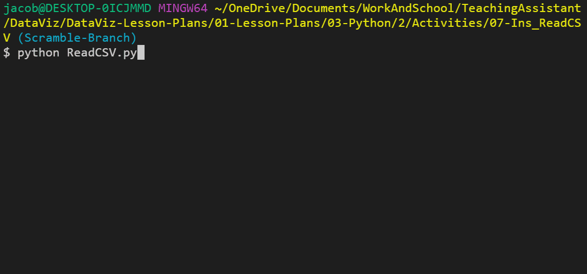
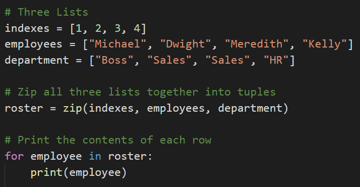

##  3.2 Lesson Plan - Reading, Writing, and Pyrithmetic

### Overview

During today's class, we will be diving further into reading and writing data from/to external CSV files. We will also dive into zipping lists and functions.

### Class Objectives

* You should feel confident reading data into Python from CSV files.

* You should feel confident writing data from Python into CSV files.

* You should know how to zip two lists together and when this is helpful.

* You should have a firm understanding on how to create and use Python functions.

---

### Reading Text Files

* Another function of Python is that it is capable of reading data in from external text files and then performing some tasks on it.

* When dealing with external files, Python requires very precise directions on what path to follow to reach the desired file. As such, if the desired file is stored within a sub-folder called "Resources", the path needed would be "Resources/FileName.txt".

* It is critical to note that different operating systems use different paths to locate files. For example: Windows machines will often use forward slashes to seperate folders while Mac devices will use backslashes.

* The `with` statement is simply saying that, for as long as we are dealing with the code within the following block, save the text variable. Once the code block has completed, the text variable will be "cleaned up" and removed to save memory.

* `open(<File Path>, <Read/Write>)` is the function Python uses in order to open up and work with external text files. By specifying wither `'r'`, `'w'`, or `'rw'`, users can use the `open()` function to either read from a text file, write to a text file, or perform both operations within the following code block.

* `text.read()` parses the data that is read in by the `open()` function and converts it into a string type. If this function was not used all that would be printed to the screen would be an unhelpful textwrapper object.

### Introduction to Modules

* While Python includes many built-in functions, sometimes programmers have to bring in external modules in order to perform specific tasks.

* If a programmer wanted a random number generator for a dice game they were making, for example, they would most likely want to use the `random` module instead of having to create the code from scratch.

* Importing modules into Python is actually very simple. All that is required is for the module to be installed and for the user to import the module into their code.

* All of the modules for today come packaged with Python, so there is no need to install anything new.

* To import a module, add `import <module name>` to the top of your Python script. You can then access the module's methods using `<module name>.<method name>`

* The `string` module contains many helpful constants and methods which pertain to strings. For example, users can use `string.ascii_letters` and Python will instantly grab a reference to every ascii character.

* The `random` module does exactly what one might expect, it allows Python to randomly select values from set ranges, lists, or even strings.

### Reading In CSVs

* While reading in text files can be useful in some circumstances, it is more likely within the data industry to run across files known as CSVs.

* CSV stands for **C**omma **S**epeated **V**alues and is essentially a table that has been converted into text format with each row and column being seperated by specified symbols.

* More often than not each row is located on a new line and each column is seperated by a comma. Seems simple enough since this is why the file type is called Comma Seperated Values.

* Python has a module called `csv` which allows its users to easily pull in data from external CSV files and perform some operations upon them. See the example in ReadCSV.py

* In this example, notice that the script imports and uses the `os` module. This module allows Python programmers to very easily create dynamic paths to external files that function across different operating systems.

* Notice that the code is still using the `with open()` syntax from earlier to read in the file originally. The key difference here is that this code now includes the `newline=''` parameter. When reading input from the file, if newline parameter is None, universal newlines mode is enabled. This means that lines in the input can end in '\n' (Unix end-of-line convention), '\r' (old Macintosh convention), or '\r\n' (Windows convention), and these are translated into '\n' before being returned to the caller. If it is '', universal newlines mode is enabled, but line endings are returned to the caller untranslated.

* See further documentation on open syntax and universal newlines:
* https://docs.python.org/3/library/functions.html#open
* https://docs.python.org/3/glossary.html#term-universal-newlines

* Instead of `text.read()`, this new code instead utilizes `csv.reader()` to translate the object being opened by Python. It is critical to note the `delimiter=','` parameter being used as this tells Python that each comma within the CSV should be seen as moving into a new column for a row.

* The code then loops through each row of the CSV and prints out the contents. Make sure to point out how each value is being shown as a string and how all of the rows are lists.

### Writing CSVs

* Not only can Python read data in from CSV files, it is also wholly capable of writing data into CSV files as well.

* While this may not seem handy at first, it allows Python users to very easily modify and/or create datasets based upon previous data.

* See [09-WriteCSV](Activities/09-Ins_WriteCSV/Write.py).

* The syntax for writing into a CSV file is thankfully very similar to that used to read data in from an external file.

* First, the code references the path that will point into the CSV file the user would like to write to.

* Next, the `with open()` statement is used once more but with one significant difference. Instead of the parameter `'r'` being passed and directing Python to read a file, the parameter `'w'` is passed in its stead to inform Python to write to the file.

* Instead of `csv.reader()`, `csv.writer()` is used to once again inform Python that this application will be writing code into an external CSV file.

* To write a new row into a CSV file, simply use the `csv.writerow(<DATA LIST>)` function and pass in an array of data as the parameter.

### Zipping Lists

* While it is possible to write new rows of data into a CSV file using a bunch of `csv.writerow()` statements, Python users can far more efficiently write data into a new CSV file by using the `zip()` function.

* `zip()` takes in a series of lists as its parameters and joins them together into a stack.

* See [10-Zip](Activities/10-Ins_Zip/zipper.py)

* This application has three lists, all of which pertain to each other and are of the same length. By zipping these lists together, there is now a single joined list whose indexes reference all three of the lists inside.

* Zipped lists are turned into tuples. This means that the lists inside of a zip can no longer be modified or added to in any way.

### Introduction to Functions

* Within the field of coding there is a popular acronym - DRY - which many coders live by. It stands for **D**ont **R**epeat **Y**ourself and essentially states that code should avoid having similar/repeating lines whenever possible.

* One of the best ways through which to prevent repetition is through the liberal usage of Python functions.

* A function is a block of organized, reusable code that is used to perform a single, related action. In other words, functions are placeable blocks of code that perform a specific action.

* See [12-Ins_Functions](Activities/12-Ins_Functions/functions.py)

* To create a new function, simply use `def <Function Name>():` and then place the code that you would like to run within the block underneath it. The code beneath the function must be indented (like a for loop or if statement).

* In order to run the code stored within a function, the function itself must be called within the program. Functions will never run unless called upon.

* Functions that take in parameters can also be created by simply adding a variable into the parentheses of the function's definition. This allows specific data to be passed into the function for usage.

