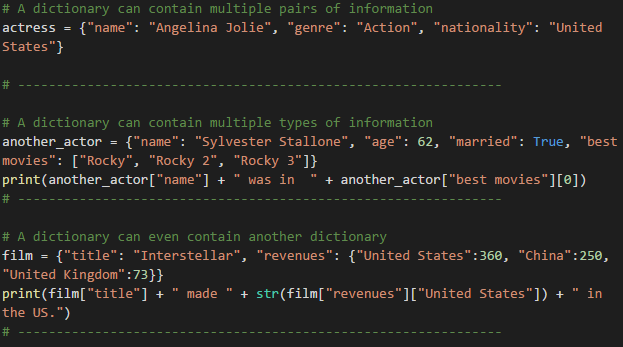
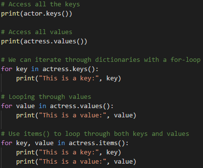
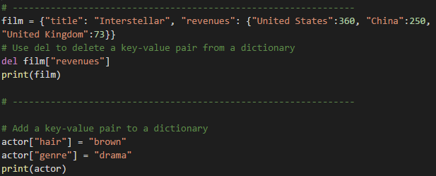

## 3.3 A Review In Python

### Overview

Today's class will wrap up the introduction to Python while also going through some basic coding logic and reasoning.

### Class Objectives

* You should be able to create and use Python dictionaries.

* You should be able to read data in from a dictionary.

* You should have a firm understanding of coding logic and reasoning.

*  You should feel far more comfortable in their understanding of Python.

----

### Dictionaries

* Another data type that is commonly used in Python is that of the dictionary.

* Like lists and tuples, dictionaries can contain multiple values and types of data within them.

* Unlike lists and tuples, however, store data in key-value pairs. The key in a dictionary is a string that can be referenced in order to collect the value it is associated with.

* A pair of curly-braces can be used to create a dictionary: `variable = {}` or `variable = dict()`

* Values can be added to dictionaries at declaration by creating a key that is stored within a string, following it with a colon, and then placing the value desired afterwards. Example, `myDict[my_key] = my_value`

* Referencing a value within a dictionary is as simple as calling the dictionary and following it up with a pair of brackets containing the key for the value desired. Example `myDict[my_key]` will access the value associated with my_key.

* Dictionaries can hold multiple pieces of information by following up each key-value pairing with a comma and then placing another key-value pair afterwards.

* Dictionaries can also store lists. They can be accessed by first calling the key and then indexing the list. Assure students they just need a basic understanding of this for now and that when they get into APIs they will get a lot more practice.

* Dictionaries can also contain other dictionaries. In order to access the values inside nested dictionaries, simply add another key to the reference.

* It is important to note how dictionaries in Python will always auto-sort alphabetically. This means that the order in which key-value pairs were declared many not be the order they would be when printed in the console.

### Keys and Values

* All keys in a dictionary can be accessed by using the `keys()` method.

* Similarly, all values in a dictionary can be accessed using the `values()` method.

* The `keys()` and `values()` methods can also be used to iterate through a dictionary using a for loop.

* The entire dictionary - both keys and values - can be iterated through by using the `items()` method.

* The `del()` function can be used to remove a key-value pair by referencing the dictionary and key within

* To add or update values within a dictionary, simply create a reference to the key desired and then set it equal to the value desired.

