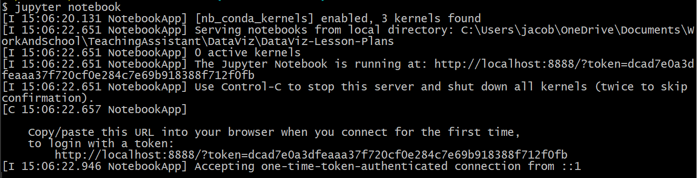
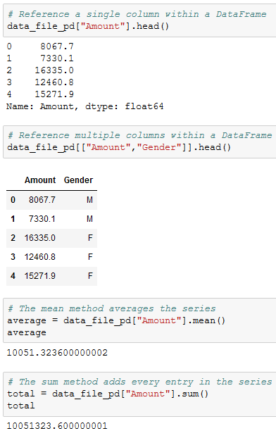
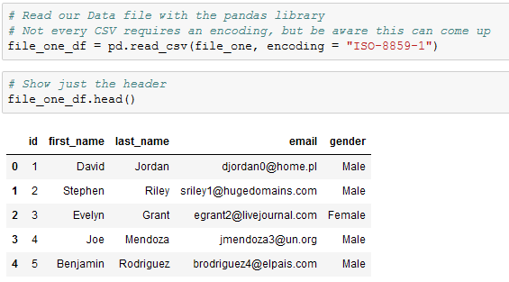
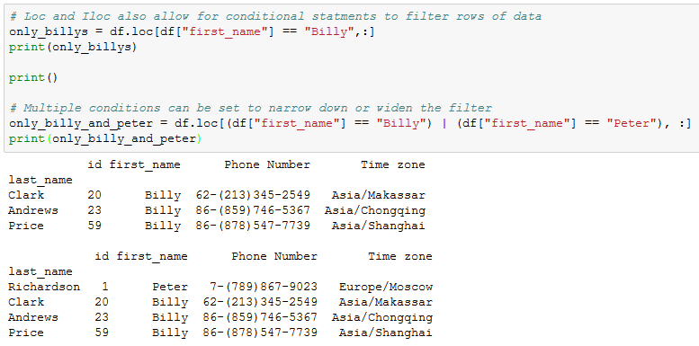
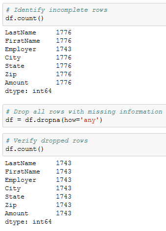

## 4.1 Lesson Plan - Introduction to Pandas & Jupyter

### Overview

Today's lesson will introduce you to Jupyter Notebook and the basics of the Pandas module.

- - -

### Class Objectives

* You should be able to serve Jupyter notebook files from local directories and connect to their development environment.
* You should be able to create Pandas DataFrames from scratch.
* You should understand how to run functions on Pandas DataFrames.
* You should know how to read/write DataFrames from/to CSV files using Pandas.
* You should understand how to navigate through DataFrames using Loc and iLoc.
* You should understand how to filter and slice Pandas DataFrames.

- - -

### Introduction to Jupyter Notebook

* Jupyter Notebook is an open-source application that allows its users to create documents that contain live code, equations, visualizations, and explantory text.

* In other words, Jupyter Notebook combines a text editor, the console, and a markdown file into one application.

* Activate the `PythonData` development environment that was created last week before typing `jupyter notebook` into the terminal.

* Running `jupyter notebook` will automatically open up a webpage where you can navigate into any files/folders within the folder you ran the command from.

* Users can create new Jupyter Notebook files from the webpage that is opened by clicking the "new" button and selecting your development environment from the list that appears.

* Python files created through Jupyter Notebook are given the `ipynb` extension rather than `py` and cannot be easily read/altered within a typical text editor.

* Create a new Python file using Jupyter Notebook, making sure to set the kernel as "PythonData"

* Setting the kernel for Jupyter projects is important because these kernels let the program know which libraries will be available for use. Only those libraries loaded into the development environment selected can be used in a Jupyter Notebook project.

* If  your development environment does not show up within Jupyter Notebook, simply run the command `conda install -c anaconda nb_conda_kernels` within the terminal so that anaconda environments can be used as kernels.

* Navigate into [01-JupyterIntro](Activities/01-Ins_JupyterIntro/JupyterIntro.ipynb) and point out how Jupyter notebook organizes Python code into cells.

* Each cell contains Python code which can be run independently by placing the cursor inside a cell and pressing `Shift + Enter`.

* Jupyter notebooks allow users to both to experiment with code directly and save it for later.

### Introduction to Pandas

* The way Jupyter Notebook allows for the testing and visualization of code really starts to shine through when these principles are applied to large tables. As you have likely realized, however, it can be rather stressful modifying huge datasets using pure Python.

* Thankfully there exists a library that, despite its cute and cuddly name, is extraordinarily powerful when it comes to visualizing, analyzing, and altering large datasets. This library is **Pandas**.

* While Python alone is stuck using lists, tuples, and dictionaries, Pandas lets Python programmers work with data structures called "Series" and "DataFrames".

* These two datatypes - unique to Pandas - are essentially structured lists, with many built-in convenience methods that allow for quick and easy manipulation of data.

* A Pandas Series is a one-dimensional labeled array capable of holding any data type. This means that, like an array, the data is linear but that, like a dictionary, it has an index that acts like a key.

* A Pandas DataFrame is a two-dimensional labeled data structure with columns of potentially different types. The easiest way to think of it is like an Excel spreadsheet with each column being a Series.

### DataFrame Creation

* Before doing anything else, the Pandas library is imported using `import pandas as pd`. This method of import allows Pandas functions/methods to be called using the variable `pd`. `pd` is the conventional way to name Pandas when you import it.

* To create a Series, simply use the `pd.Series()` function and place a list within the parentheses. The index for the values within the Series will be the numeric index of the initial list.

* There are multiple ways through which to create DataFrames from scratch. One way is to use the `pd.DataFrame()` function and provide it with a list of dictionaries. Each dictionary will represent a new row where the keys become column headers and the values will be placed inside the table.

* Another way is to use the `pd.DataFrame()` function like before but this time provide it with a dictionary of lists. The keys of the dictionary will be the column headers and the listed values will be placed into their respective rows.

### DataFrame Functions

* The benefits of using Pandas DataFrames does not lay solely in its visualization of tables. There are also many functions/methods that come packaged with Pandas that allow for quick and easy analysis of large datasets.

* The method `head()` which takes a DataFrame and shows only the first five rows of data inside of it. This number can be increased/decreased, however, by placing an integer within the parentheses. Use `head()` on a dataframe: `df_name.head()`.

* The `head()` method is helpful insomuch as it allows the programmer to look at a minified version of a much larger table, thus allowing them to make informed changes without having to search through the entire dataset. If you want to see more or less rows than 5, you can specify the number of rows within the function, for example, `df_name.head(2)` or `df_name.head(15)`.

* Another useful method comes in the form of `describe()` which will print out a DataFrame containing some analytic information on the table and its columns. It is also helpful in showing what other data functions can be performed on a DataFrame or Series.

* Most data functions can also be performed on a Series by referencing a single column within the whole DataFrame. This is done in a similar way to referencing a key within dictionary by taking the DataFrame and following it up with brackets with the desired column's header contained within like a key.

* Multiple columns can be referenced as well by placing all of the column headers desired within a pair of double brackets. If two sets of brackets are not used then Pandas will return an error.

* There are situations in which it is helpful to list out all of the unique values stored within a column. This is precisely what the `unique()` function does by looking into a Series and returning all of the different values within.

* Another method that holds similar functionality is that of `value_counts()` which not only returns a list of all unique values within a series but also counts how many times a value appears.

* Calculations can also be performed on columns and then added back into a DataFrame as a new column by referencing the DataFrame, placing the desired column header within brackets, and then setting it equal to a Series.

### Modifying Columns

* Columns within a DataFrame are not always placed within the desired position by default. In fact, they sometimes may not even have a descriptive or concise enough name.

* Thankfully it is very easy to modify the names/placement of columns using the `rename()` function and the use of double brackets.

* In order to collect a list of all the columns contained within a DataFrame, simply use the `df.columns` call and an object containing the column headers will be printed to the screen.

* To reorder the columns, create a reference to the DataFrame followed by two brackets with the column headers placed in the order desired.

* It is also possible to remove columns in this way by simply not creating a reference to them. This will, in essence, drop them from the newly made DataFrame.

* To rename the columns within a DataFrame, use the `df.rename()` method and place `columns={}` within the parentheses. Inside of the dictionary, the keys should be references to the current columns and the values should be the desired column names.

### Reading and Writing CSVs

* Up until this point in time, the class has had to manually create DataFrames using the `pd.DataFrame()` method. There is a far more effective means by which to create large DataFrames; importing CSVs.

* Create a reference to the CSV's path and pass it in into the `pd.read_csv()` method, making certain to store the returned DataFrame within a variable. From then on, the DataFrame can be altered and manipulated like normal.

* In most cases it is not important to use or define the encoding of the base CSV file but if the encoding is different than UTF-8, then it may become necessary so that the csv is translated correctly.

* It is just as easy to write to a CSV file as it is to read from one. Simply use the `df.to_csv()` method, passing the path to the desired output file. By using the `index` and `header` parameters, programmers can also manipulate whether they would like the index or header for the table to be passed as well.

* If the file referenced within the path does not exist, then Pandas will return an error. The file must already exist in order for the DataFrame to be written in.

### Exploring Data With Loc and iLoc

* One of the most powerful aspects of Pandas is how easily programmers can collect specific rows/columns of data from a DataFrame using the `loc()` and `iloc()` methods.

* The `loc()` method allows its users to select data using label based indexes. In other words, it takes in strings as the keys and returns data based upon that.

* Using `loc()` to search through rows is only really useful when the index of a dataset is a collection of strings. It is almost always useful when selecting data from rows, however, since column headers are exclusively strings. This can be done by using the `df.set_index()` function and passing in the desired column header for the index.

* The `iloc()` method also allows its users to select data, but instead of using labels, it instead uses integer based indexing for selection by position. In other words, it selects data in much the same way as one would select data from within a list; using a numeric index.

* Open up [12-Ins_LocAndIloc](Activities/12-Ins_LocAndIloc/LocAndIloc.ipynb) within Jupyter Notebook and run through the code line-by-line with the class.

* The typical way in which data is called using both `loc[]` and `iloc[]` is by using a pair of brackets which contain the rows desired, followed by a comma, and then the columns desired. For example: `loc["Berry","Phone Number"]` or `iloc[1,2]`

* It is also possible to select a range of data using `loc[]` and `iloc[]` by placing all of the values within brackets and/or using a colon to tell Pandas to look for a range. For example: `loc[["Richardson", "Berry", "Hudson", "Mcdonald", "Morales"],["id", "first_name", "Phone Number"]]` or `iloc[0:4, 0:3]`

* By passing in a colon by itself, `loc[]` and `iloc[]` will select all rows or columns depending on where it is placed in relation to the comma. For example: `loc[:, ["first_name", "Phone Number"]` will select all rows of data but will only return the "first_name" and "Phone Number" columns.

* Another exciting feature of `loc[]` and `iloc[]` is that these methods can be used to conditionally filter rows of data based upon the values contained within a column.

* The way in which this is done is by calling `loc[]` or `iloc[]` on a DataFrame and passing a logic test in place of the rows section of the call. For example: `loc[df["id"] >= 10, :]` will return all rows of data with a value equal to or greater than 10 within the "id" column.

* It is possible to then select which columns to return by simply adding their references into the columns section of the `loc[]` or `iloc[]` expression.

* If there are multiple conditions that should be checked for, `&` and `|` may also be added into the logic test as representations of `and` and `or`. This allows for a great amount of customization.

### Cleaning Data

* When dealing with massive datasets it is almost inevitable that duplicate rows, inconsistent spelling, and missing values will crop up.

* While these issues may not seem significant in the grand scheme of things, they can severely hinder the analysis and visualization of a dataset by skewing the data one way or another.

* Thankfully Pandas includes methods through which its users can remove missing values, replace duplicates, and change values with relative ease.

* Open up [14-Ins_CleaningData](Activities/14-Ins_CleaningData/CleaningData.ipynb) within Jupyter Notebook and run through the code line-by-line with the class.

* In order to delete a column of extraneous information from a DataFrame: `del <DataFrame>[<Column>]`

* In order to figure out if any rows are missing data, simply run the `count()` method on the DataFrame and check that all columns contain equal values.

* In order to drop rows with missing information from a DataFrame: `<DataFrame>.dropna(how="any")`

* Sometimes the rows containing "NaN" values should not be removed but should instead be filled with another value. In cases like these, simply using the `<DataFrame>.fillna(value=<Value>)` method and pass the value desired into the parentheses.

* In order to find values that have similar/mispelled values, simply run the `value_counts()` method on the column in question and look through the values that are returned.

* To replace similar/mispelled values, simply run the `replace()` method on the column in question and pass a dictionary into it with the keys being those values to replace and the value being those to replace the originals with.

