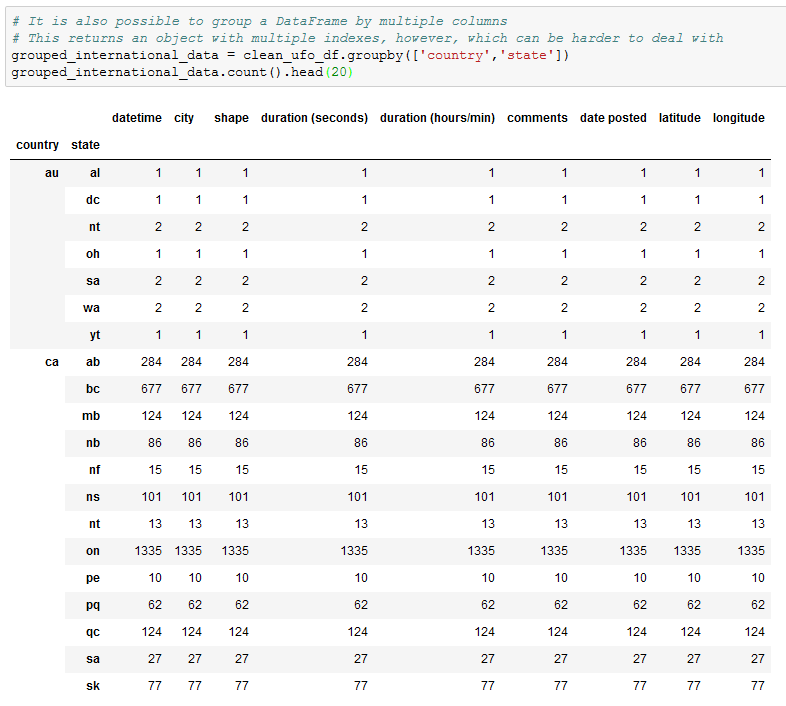
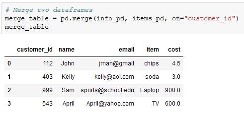

## 4.2 Exploring Pandas

### Overview

Today's lesson dives deeply into Pandas and covers some of the library's more complex functions - like grouping, merging, and binning - whilst solidifying the concepts from the last class.

- - -

### Class Objectives

* You should understand how to create and access Pandas GroupBy objects.
* You should understand how to sort DataFrames.
* You should know how to merge DataFrames together whilst understanding the differences between inner, outer, left, and right merges.
* You should be able to slice data using the `cut()` method and create new values based upon a series of bins.

- - -

### Pandas Grouping

* The `df.groupby([<Columns>])` method is then used in order to split the DataFrame into multiple groups with each group being a different state within the US.

* The object returned by the `.groupby()` method is a GroupBy object and cannot be accessed like a normal DataFrame. In fact, one of the only ways in which to access values within a GroupBy object is by using a data function on it.

* It is possible to create new DataFrames using purely GroupBy data. This can by done by taking the `pd.DataFrame()` method and passing the GroupBy data desired in as the parameter.

* A DataFrame can also be created by selecting a single series from a GroupBy object and passing it in as the values for a specified column.

* It is possible to perform a `df.groupby()` method on multiple columns as well. This can be done by simply passing two or more column references into the list parameter.

### Sorting Made Easy

* In order to sort a DataFrame based upon the values within a column, simply use the `df.sort_values()` method and pass the column name to sort by in as a parameter.

* The parameter of "ascending" is always marked as True by default. This means that the `sort_vales()` method will always sort from lowest to highest unless the parameter of `ascending=False` into passed into the `sort_values()` method as well.

* Something immensely helpful when dealing with sorted DataFrames is the `df.reset_index()` method. This method will recalculate the index for each row based upon their position within the new DataFrame and, as such, will allow for far simpler referencing of rows in the future.

* Passing `drop=True` into `df.reset_index()` will ensure no new column is created when the index is reset.

* It is possible to sort based upon the values stored within multiple columns by passing a list of columns into the `sort_values()` method as a parameter. The first column will be the primary sorting method with ties being broken by the second column.

### Merging DataFrames

* Sometimes the data an analyst is provided with is split into multiple parts. This, of course, is not an ideal situation as it is far more preferable to work with a single dataset than it is to work with a bunch of different datasets.

* This is where the concept of merging comes into play, as Pandas allows its users to quite easily combine separate DataFrames on similar values using the `pd.merge()` method.

* The first chunks of code are used to create two DataFrames which contain information on customers and the purchases they have made.

* Make sure to point out how these two DataFrames share the "customer_id" column in common. This will be very important soon.

* In the final chunk of code, the `pd.merge()` method is used and three parameters are passe into it: references to both of the DataFrames and the value `on="customer_id"`.

* This code tells the computer to combine the two DataFrames together so that, whenever the "customer_id" column matches, the rows containing the matching data are joined.

* This is what is known as an inner join. Inner joins are the default means through which DataFrames are combined using the `pd.merge()` method and will only return data whose values match. Any rows that do not include matching data will be dropped from the combined DataFrame.

* The opposite of an inner join is an outer join. Outer joins will combine the DataFrames regardless of whether any of the rows match and must be declared as a parameter within the `pd.merge()` method using the syntax `how="outer"`.

* Any rows that do not include matching data will have the values within replaced with `NaN` instead.

* There are also right and left joins. These joins will protect the data contained within one DataFrame like an outer join does whilst also dropping the rows with null data from the other DataFrame.

### Instructor Do: Binning Data

* Not everyone is a numbers person and sometimes there are so many values within a DataFrame that it becomes very difficult to comprehend what exactly is going on. For this reason, Pandas has a built-in "binning" method that allows its users to place values into groups so as to allow for more vigorous customization of datasets.

* When using the `pd.cut()` method, three parameters must be passed in. The first is the Series that is going to be cut. The second is a list of the bins that the Series will be sliced into. The last is a list of the names/values that will be given to the bins.

* It is important to note how, when creating the list for bins, Pandas will automatically determine the range between values. This means that, when given the list `[0, 25, 50, 75, 100]`, Pandas will create four bins with ranges between those values in the list.

* The labels for the `pd.cut()` method must have an equal length to the number of bins. If there are too many or too few, an error will be returned.

* What makes binning so powerful is that, after creating and applying these bins, the DataFrame can be grouped according to those values and thus a higher-level analysis can be conducted.

