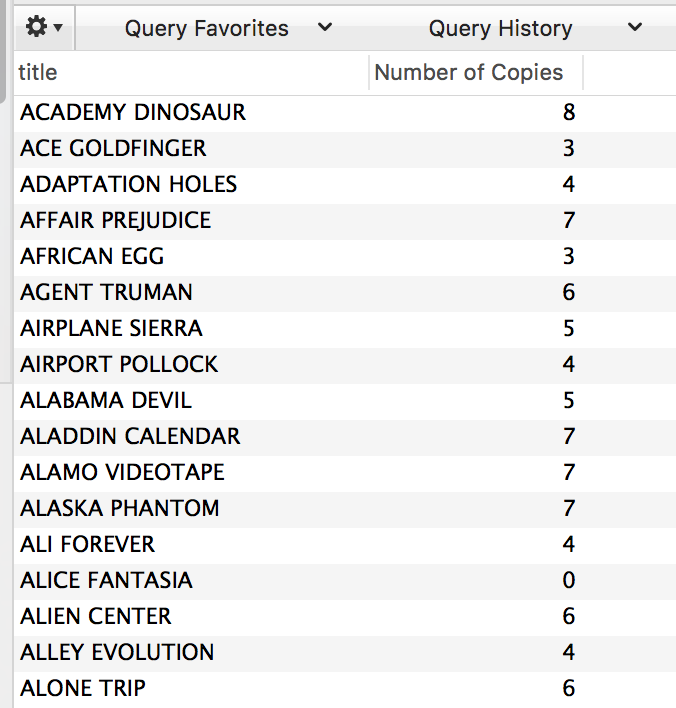

# A View with a Roomful of Queries

## Instructions

1. Write a MySQL statement to query a film title, and the numbers of copies that exist in the inventory for that title. The results should look like the below. Your challenge is to use a subquery--a query embedded within another query--instead of a join.

   
  
   ```sql
   SELECT title, (SELECT COUNT(*) FROM inventory WHERE film.film_id = inventory.film_id ) AS 'Number of Copies'
   FROM film;
   ```
    Note, the above works, but I personally think this is easier to write and understand:
   ```sql
   SELECT COUNT(*) as 'Number of Copies', title 
   FROM inventory join film WHERE film.film_id = inventory.film_id
   Group BY title;
   ```
  
2. Create a view with the above query and run it. 
```sql
CREATE VIEW total_sales AS
SELECT title, (SELECT COUNT(*) FROM inventory WHERE film.film_id = inventory.film_id ) AS 'Number of Copies'
   FROM film;
```

