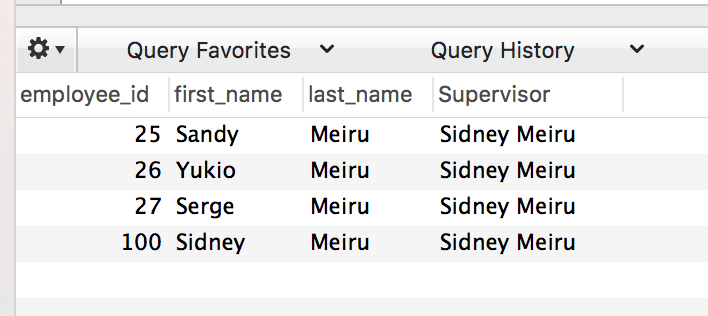

# Self Joins

## Instructions

* A very common case for self joins is a table of employees. 

1. Open the [employees.sql](employees.sql) file included in this folder, and create an `emps` table, then insert data into it.

2. Each row in this table contains the ID number of the employee, as well as the ID number of that employee's supervisor. Each supervisor, in turn, is listed as an employee. An employee who has no supervisor has him/herself listed as the supervisor. 

3. Perform a self join to recreate the following:

   

   ```sql
   SELECT A.employee_id, A.first_name, B.last_name, CONCAT(B.first_name, ' ', B.last_name) AS 'Supervisor'
   FROM emps A
   JOIN emps B
   ON (A.supervisor_id = B.employee_id);
   ```
  
## Hint

* The column listing the supervisor need not be a single column. However, to do so, consult this [link](https://www.w3schools.com/SQl/func_mysql_concat.asp) for info on the `CONCAT` function in MySQL.

